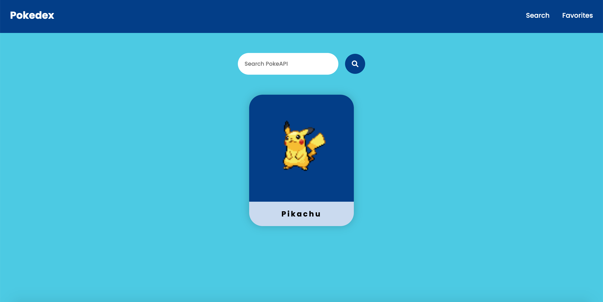
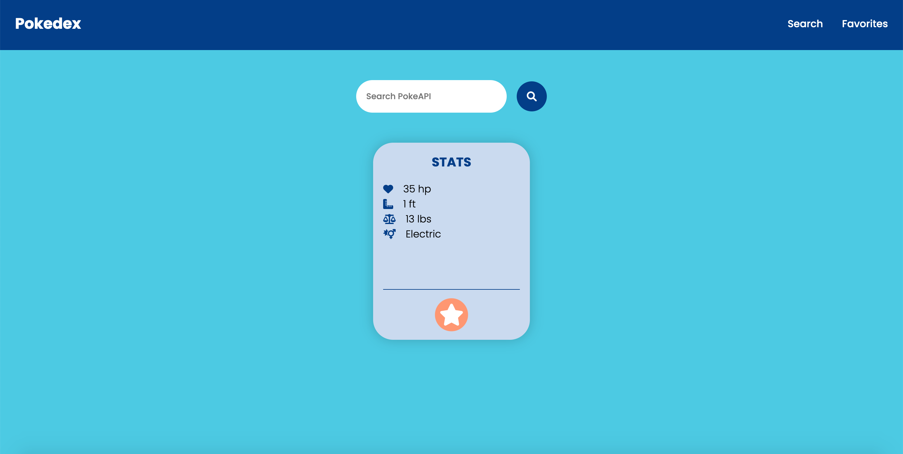
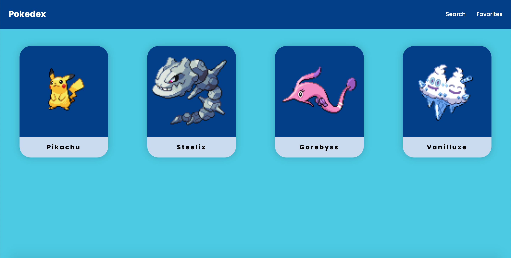
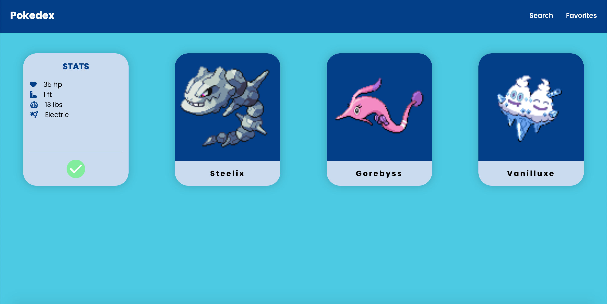

# Pokedex

### Links:
[Demo](https://pokedex-lv.herokuapp.com/)

[Repo](https://github.com/loganveik/api-react-test)

### Description:
Pokedex is an app where the user can search any pokemon via PokeAPI. A pokecard will be displayed with info related to searched pokemon. User can then click the orange star button on the card which will add that pokecard to favorites via local storage. User can view all favorited pokecards on the favorites page.

### Technologies Used:
React, localStorage, CSS, Axios, PokeAPI

### How to Use:
1) Search Page

2) Searching PokeApi for Pikachu

3) Hovering over Pokecard will flip card to reveal stats and an orange star button which will "Add To Favorites"

4) Favorites Page displaying all favorites including the recently-added Pikachu

5) Hovering over Pokecard will flip card to reveal a green check button which will "Remove From Favorites"
